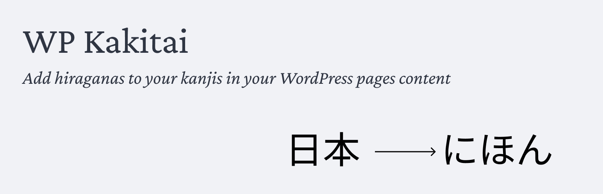

# Kakitai (書きたい)

[](https://github.com/firestar300/wp-kakitai/)

[](https://github.com/firestar300/wp-kakitai/blob/main/LICENSE)
[](https://wordpress.org/)

> A WordPress plugin to automatically add furigana (振り仮名) to Japanese kanji in the Gutenberg editor.

## 📖 Description

**Kakitai** is a WordPress plugin that makes reading Japanese easier by automatically adding furigana (pronunciation guides in hiragana) to kanji. The plugin integrates directly into the Gutenberg editor and uses the Kuromoji library for accurate Japanese morphological analysis.

### ✨ Features

- 🎯 **Automatic furigana addition**: Select Japanese text and add furigana with one click
- 🔄 **Toggle on/off**: Click again to remove furigana
- 📝 **Supported blocks**: Paragraph and Heading blocks
- 🏷️ **Standard HTML tags**: Uses `<ruby>`, `<rt>`, and `<rp>` tags for maximum compatibility
- 🎨 **Native integration**: Button in the editor toolbar
- 🚀 **Optimized performance**: Client-side morphological analysis with caching

## 🎬 Demo

```html
<!-- Before -->
今日は良い天気です

<!-- After -->
<ruby>今日<rp>(</rp><rt>きょう</rt><rp>)</rp></ruby>は<ruby>良<rp>(</rp><rt>よ</rt><rp>)</rp></ruby>い<ruby>天気<rp>(</rp><rt>てんき</rt><rp>)</rp></ruby>です
```

## 📦 Installation

### Via GitHub Release

1. Download the latest `wp-kakitai.zip` from the [releases page](https://github.com/firestar300/wp-kakitai/releases)
2. In WordPress, go to **Plugins → Add New**
3. Click **"Upload Plugin"**
4. Select the downloaded ZIP file
5. Click **"Install Now"**
6. Activate the plugin

### Manual Installation

```bash
cd wp-content/plugins
git clone https://github.com/firestar300/wp-kakitai.git
cd wp-kakitai
npm install
npm run build
```

Then activate the plugin in WordPress.

## 🚀 Usage

1. Open the Gutenberg editor
2. Create or edit a Paragraph or Heading block
3. Select Japanese text containing kanji
4. Click the **Furigana** button (🌐 icon) in the toolbar
5. Furigana are automatically added!
6. Click the button again to remove furigana

## 🛠️ Development

### Prerequisites

- Node.js 20+
- npm
- WordPress 6.7+
- PHP 7.4+

### Setup for Development

```bash
# Clone the repository
git clone https://github.com/firestar300/wp-kakitai.git
cd wp-kakitai

# Install dependencies
npm install
composer install

# Start development mode
npm start

# Or build for production
npm run build
```

### Project Structure

```
wp-kakitai/
├── src/
│   ├── index.js              # Main entry point
│   ├── style.scss            # Editor styles
│   └── hooks/
│       └── useKanjiFurigana.js  # React hook for Kuromoji
├── build/                    # Compiled files (generated)
│   ├── index.js
│   └── dict/                 # Kuromoji dictionaries
├── wp-kakitai.php           # Main plugin file
├── webpack.config.js         # Webpack configuration
└── package.json             # npm dependencies
```

### npm Scripts

```bash
npm start          # Development mode with watch
npm run build      # Production build
npm run lint:js    # JavaScript linter
npm run lint:css   # CSS linter
npm run format     # Format code
```

### Composer Scripts

```bash
composer install   # Install PHP dependencies
composer lint      # PHP linter (PHPCS)
composer format    # Auto-fix PHPCS issues
```

## 🧪 Technologies

- **WordPress Gutenberg**: Block API
- **React**: UI framework
- **Kuromoji.js**: Japanese morphological analyzer
- **Webpack 5**: Bundler with Node.js polyfills
- **@wordpress/scripts**: WordPress build tools

## 📝 Changelog

See [CHANGELOG.md](CHANGELOG.md) for version history.

## 🤝 Contributing

Contributions are welcome! Feel free to:

1. Fork the project
2. Create a feature branch (`git checkout -b feature/AmazingFeature`)
3. Commit your changes (`git commit -m 'Add some AmazingFeature'`)
4. Push to the branch (`git push origin feature/AmazingFeature`)
5. Open a Pull Request

## 📄 License

This project is licensed under GPL-2.0-or-later. See the [LICENSE](LICENSE) file for details.

## 🙏 Acknowledgments

- [Kuromoji.js](https://github.com/takuyaa/kuromoji.js) for morphological analysis
- The WordPress community for development tools
- All contributors who helped improve this project

## 👤 Author

**firestar300**

- GitHub: [@firestar300](https://github.com/firestar300)

## ⭐ Support

If you find this project useful, please give it a ⭐ on GitHub!

---

Made with ❤️ for the Japanese language learning community
